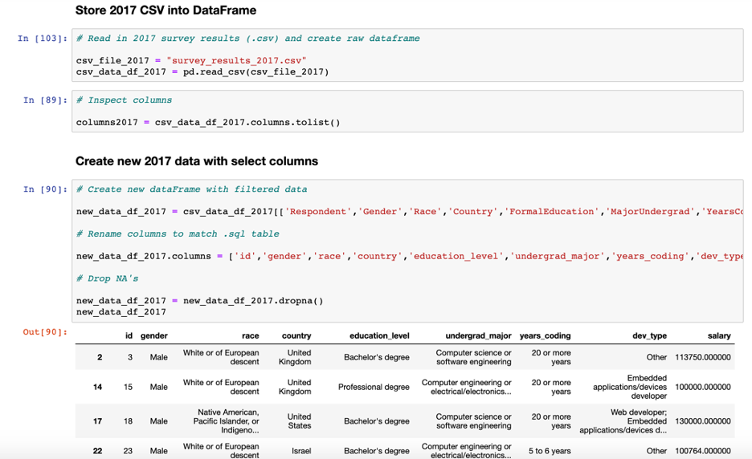

# ETL - Extract, Transform, Load

## Extract: Original data sources and how the data was formatted (CSV, JSON, pgAdmin 4, etc).

#### Data Sources:

* https://www.kaggle.com/stackoverflow/so-survey-2017¶
* https://www.kaggle.com/stackoverflow/stack-overflow-2018-developer-survey
* https://www.kaggle.com/mchirico/stack-overflow-developer-survey-results-2019

The above datasets were all converted to .csv format, in order to work with them in jupyternotebook

## Transform:
#### The type of transformation needed for this data (cleaning, joining, filtering, aggregating, etc).

- Cleaned data - dropped NA's
- Inspected column names to find column names that contained the same info across all three years
- Filtered data - filtered only for columns that we wanted:
'id','gender','race','country','education_level','undergrad_major','years_coding','dev_type','salary'
- Renamed columns to be uniform across all 3 years (2017-2019)

## Load:

#### The type of final production database to load the data into (relational or non-relational).

- Relational database (.sql)

#### The final tables or collections that will be used in the production database.

- SQL Database: 'stackoverflow_survey_db'
- Tables within DB: 'survey_2017', 'survey_2018', 'survey_2019'

The SQL database and tables were chosen so that survey would have a separate table with common elements across all 3 years.  
In the future, new tables can be added, with the same elements, iterating through the same process for each year (read in .CSV, clean, transform, insert into .SQL table, etc.)
